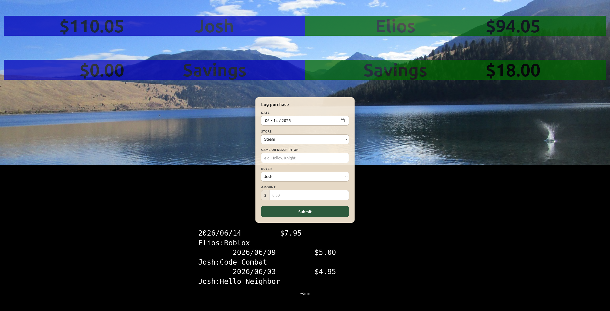

# Game Budget

A self-hosted allowance kiosk for game spending at home. Gamers check their balance and log
Steam, Epic, and other purchases from any browser on the LAN; parents set daily budgets
and optional savings rules on a separate admin page.



## Why use it

**Teach money management.** A daily allowance that accrues in real time turns abstract
limits into something gamers can see and reason about — how much they have, what a purchase
costs, and what they have left.

**Add structure to in-game spending.** Instead of negotiating every sale ad hoc, the
household agrees on a budget up front. Purchases go in the ledger; the rules stay
consistent.

**Let gamers own their Steam budget.** Each gamer logs their own transactions from a phone or
PC. They build the habit of checking balance before buying and recording what they spent,
without handing over your payment password for every checkout.

Game Budget runs on your network. Your data stays in a plain-text journal on your machine
— no cloud account, no subscription.

## Prerequisites

- [Docker Desktop](https://www.docker.com/products/docker-desktop/) (or Docker Engine + Compose on Linux)
- Port **8080** available on the host
- Devices on the same home Wi‑Fi / LAN

No app install on gamers' devices — only a web browser.

## Quick start

```bash
git clone <repository-url> game-budget
cd game-budget
mkdir -p data
docker compose up --build -d
```

Open **`http://<host-ip>:8080`** from a phone or PC on your LAN (find the IP with `hostname -I` on Linux).

1. Go to **`/admin`** → log in with **`admin`**
2. **Change the admin password**
3. Set daily budgets per gamer → **Save settings**
4. Bookmark the kiosk URL for the family

**New to the project?** Follow the full walkthrough: **[Getting started](docs/getting-started.md)** (fresh install or migrating an existing ledger).

## Documentation

| Guide | Description |
|-------|-------------|
| [Getting started](docs/getting-started.md) | Install, first run, customize gamers, checklist |
| [Operations](docs/operations.md) | Backup, upgrade, logs, HTTPS, bare metal |
| [Troubleshooting](docs/troubleshooting.md) | Common problems |
| [Smoke test](docs/smoke-test.md) | Verify an install end-to-end |
| [Application overview](docs/application.md) | Ledger format, architecture, security |
| [Roadmap](docs/roadmap.md) | Planned work |

## Data layout

| Path | Purpose |
|------|---------|
| `data/journal.dat` | Ledger journal (Docker volume) |
| `data/config.yaml` | Gamer names, colors, budgets, admin hash |

Back up `./data` before upgrades. Import via `/admin` accepts **any filename**; export downloads `journal.dat`.

## Development

```bash
nix develop   # optional: Python, ledger, uv, just
uv sync --group dev
just init && just run
just test
```

## License

MIT — see [LICENSE](LICENSE). ledger-cli is BSD 3-Clause — see [THIRD_PARTY_NOTICES](THIRD_PARTY_NOTICES).
