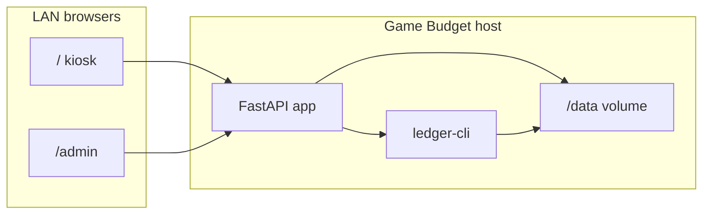

# Application overview

Game Budget is a self-hosted web app for managing children's game spending allowances on a home LAN. Parents configure daily budgets and optional savings rules; children (or anyone on the network) use a shared kiosk page to log purchases. All accounting lives in a plain-text **ledger-cli** journal file (`journal.dat`), compatible with the original Flask app ledger format and editable outside the web UI.

## Who it is for

- **Households** that want a simple, phone-friendly way to track game purchases against a daily allowance.
- **Parents** who need a password-protected settings page for budgets, import/export, and configuration.
- **Operators** who already use ledger-cli and want a plain-text journal as the source of truth — no database, no proprietary format.

The app assumes a **trusted home network**: the kiosk has no login; only `/admin` requires a password.

## How it works



1. **Daily allowance** — A `~ Daily` periodic block at the top of `journal.dat` accrues each child's budget. Ledger-cli expands this automatically when computing balances.
2. **Purchases** — The kiosk form appends transactions to the journal (Steam, Epic, savings transfers, hardware, etc.).
3. **Balances** — The app shells out to `ledger balance` and flips signs for display (wallet balances show as positive dollars).
4. **Savings cron** — If configured, once per day the app appends a `cron` transaction moving money from the child's wallet into savings.

## Web pages

### Kiosk (`/`)

Shared dashboard with no login. Layout matches the legacy Flask UI:

- Two columns (defaults to first two children in config) showing **wallet** and **savings** balances. The side-by-side layout requires **two children**; with one child, the form still works but balances may not display prominently (see [Getting started — limitations](getting-started.md#known-limitations-v1)).
- Transaction form: date, seller, game description, buyer, cost.
- CSRF token on POST; full page reload after a successful submit.

| Field | Options | Purpose |
|-------|---------|---------|
| `seller` | Steam, Epic, Other, Savings | Payee / transaction type |
| `buyer` | Child name, `{Child} Savings`, Hardware, Mom, Dad | Which account is debited |
| `game` | Free text | Expense account detail (`{Child}:Gaming:{game}`) |
| `cost` | Dollar amount | Must be positive |

Insufficient balance is rejected unless **allow overdraft** is enabled in admin settings.

### Admin (`/admin`)

Password-protected (bcrypt hash in `config.yaml`). Default password on first run: `admin` — change it immediately.

| Feature | Description |
|---------|-------------|
| Daily budgets | Updates `config.yaml` and rewrites the `~ Daily` block in `journal.dat` |
| Savings cron | Dollars per day swept into `{Child}:Savings` (0 = disabled) |
| Background image | URL path served from `/static` (default: `/static/default-bg.svg`) |
| Allow overdraft | Skip balance checks on kiosk purchases |
| Export | Download `journal.dat` |
| Import | Replace journal from any uploaded file (backs up current file to `journal.dat.bak`) |

## Data files

All runtime state lives under the data directory (default `./data`, or `GAME_BUDGET_DATA` / Docker volume `/data`):

| File | Purpose |
|------|---------|
| `journal.dat` | Ledger journal — source of truth for all money movement |
| `config.yaml` | Child names, colors, daily budgets, savings cron, admin password hash, secret key |
| `journal.dat.bak` | Created automatically before an import |
| `journal.dat.lock` | File lock during journal writes |

Back up the entire data directory before upgrades or imports.

### `config.yaml` shape

```yaml
children:
  - name: Cleanrig
    color: darkgreen
    daily_budget: 5.0
    savings_cron: 0.0
  - name: Falafel
    color: "#0606ba"
    daily_budget: 5.0
    savings_cron: 1.0
admin_password_hash: "..."
background_image: /static/default-bg.svg
secret_key: "..."
allow_overdraft: false
```

On first run, children are inferred from the `~ Daily` block if `config.yaml` has none. Daily budgets in config are synced back into the journal header.

## Ledger design

The app uses the **ledger-cli journal format** natively. There is no schema migration — export is a straight file copy. Import accepts a ledger file under any filename.

### Daily allowance (`~ Daily`)

```
~ Daily
	Falafel			$5.00
	Cleanrig		$5.00
	Assets
```

Ledger-cli treats this as a periodic transaction. When a parent changes a daily budget on `/admin`, only this header block is rewritten; the rest of the file is untouched.

### Account naming

| Role | Pattern | Example |
|------|---------|---------|
| Child wallet | `Assets:{Child}` | `Assets:Falafel` |
| Game purchase | `{Child}:Gaming[:detail]` | `Falafel:Gaming:war thunder stuffs` |
| Savings | `{Child}:Savings` | `Falafel:Savings` |
| Savings funding | `Expenses:Gaming:Saving` | Used by savings cron |
| Hardware | `Assets:Hardware`, `Hardware:Gaming:...` | Shared hardware wallet |
| Parents | `Mom:Gaming:*`, `Dad:Gaming:*` | Parent purchases |

### Form → journal examples

**Game purchase** (buyer Falafel, seller Steam):

```
2026/05/02 Steam
        Falafel:Gaming:war thunder stuffs    $6.60
        Assets:Falafel
```

**Deposit to savings** (seller Savings, buyer Falafel Savings):

```
2023/09/24 Savings
    Falafel:Savings                           $-1.11
    Assets:Falafel
```

**Spend from savings** (buyer Falafel Savings):

```
2024/09/05 spend savings
    Falafel:Gaming:League                     $10.99
    Falafel:Savings
```

**Savings cron** (automatic, once per day per child when enabled):

```
2026/06/14 cron
    Falafel:Savings                            $1.00
    Expenses:Gaming:Saving
```

### Balance display

**Wallet** uses the same budget query as the legacy Flask kiosk — remaining allowance, not the full asset account:

```text
ledger -E -f journal.dat --budget bal --invert
```

The child name (e.g. `Falafel`) is looked up in that report. **Savings** uses the sub-account balance:

```text
savings_display = ledger_balance("Falafel:Savings")
```

### Write path

- **Append** — Purchases and cron entries are appended at EOF under a file lock.
- **Rewrite** — Only the `~ Daily` header when budgets change.
- **Never** shell out to ledger for writes.

Historical entries (chores, `Gugga:Bucks`, equity adjustments) are preserved in the journal but have no dedicated kiosk UI in v1.

## Architecture

| Layer | Choice |
|-------|--------|
| Runtime | Python 3.12+ |
| Web | FastAPI, Jinja2 templates |
| Accounting | ledger-cli subprocess for balances |
| Config | YAML in data directory |
| Scheduling | In-process savings cron (checked on each request) |
| Auth | CSRF on forms; signed cookie session for `/admin` only |

### Source layout

```text
src/game_budget/
  main.py              # App factory, static files, middleware
  config.py            # YAML load/save, ~ Daily sync
  auth.py              # CSRF and admin session tokens
  service.py           # Init, balances, savings cron, validation
  cli.py               # game-budget serve | init
  ledger/
    journal.py         # Append, lock, read/write
    periodic.py        # ~ Daily parse and rewrite
    balances.py        # ledger-cli wrapper
    transactions.py    # Form → journal entry formatting
  web/
    routes_kiosk.py    # GET/POST /
    routes_admin.py    # /admin routes
    templates/         # kiosk.html, admin/
```

## Deployment

### Docker (recommended)

The Docker image bundles Python and ledger-cli. No host install of ledger is required.

```bash
mkdir -p data
cp /path/to/your/journal.dat data/journal.dat   # optional; or import via /admin
docker compose up --build
```

Open `http://<host>:8080` from any device on the LAN. The `./data` volume persists across container restarts. See [Getting started](getting-started.md) for a full walkthrough.

### Bare metal

Requires `ledger` on `PATH` and a Python environment:

```bash
uv sync --group dev
uv run game-budget init --data ./data
uv run game-budget serve --data ./data --host 0.0.0.0
```

An example systemd unit is in `deploy/game-budget.service`. See [Operations — bare metal](operations.md#bare-metal).

### Development

```bash
nix develop          # optional: Python, ledger, uv, just
just sync && just init && just run
just test
```

## Security

Proportionate for a home LAN app:

- Kiosk `/` — no authentication; CSRF on POST only.
- `/admin` — bcrypt password, `HttpOnly` session cookie, `SameSite=Lax`.
- Journal writes — exclusive file lock to avoid concurrent corruption.
- HTTPS — not required for v1; see [Operations — HTTPS](operations.md#https-optional).

Restrict filesystem permissions on the data directory to the service user.

## CLI

```bash
game-budget init [--data PATH] [--sample PATH]   # Create data dir and default journal
game-budget serve [--data PATH] [--host HOST] [--port PORT]
```

Environment variable `GAME_BUDGET_DATA` sets the data directory when `--data` is omitted.

## Testing

```bash
uv run pytest
```

`tests/test_journal_compat.py` asserts wallet and savings balances against `samples/journal.dat` match ledger-cli output, and verifies `~ Daily` parse/rewrite. The balance test is skipped if `ledger` is not installed.

## License

The application is MIT — see [LICENSE](../LICENSE). ledger-cli is BSD 3-Clause — see [THIRD_PARTY_NOTICES](../THIRD_PARTY_NOTICES).
